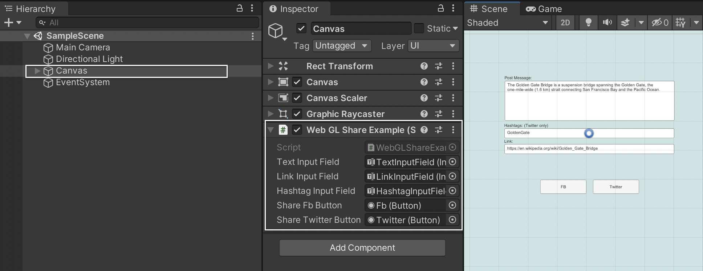

# UnityWebGLSocialShare

<b>UnityWebGLSocialShare</b> is a small JS+C# library that allows you to share posts on `Facebook` and `Twitter` from WebGL build of your Unity application.

<a href="https://kovnir.github.io/webglshare" target="_blank">Example</a>

⚠️ The plugin works only in the WebGL. In the Unity Editor, you will only see the log with the text of the post in the Console.


## AssetStore
Coming soon...

## UPM
Coming soon...

## API

### Namespace

To use `UnityWebGLSocialShare` you need to add namespace in each class where you want to use it.
```c#
using Kovnir.WebGLSocialShare;
```
### Function Call

All API is in the WebGLSocialShare class.

```c#
WebGLSocialShare.Facebook("This is post text", "http://your-site.com");
WebGLSocialShare.Twitter("This is post text", "http://your-site.com", "hashtag");
```

## Example
To see the example of plugin usage, open the `SampleScene` scene and check `WebGLShareExample` script.

