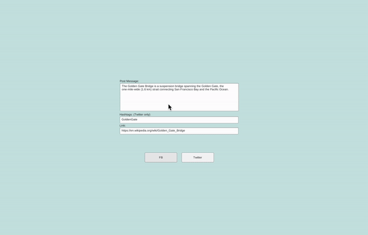
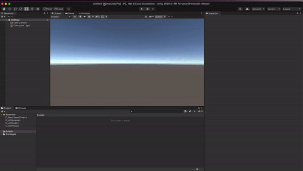

# UnityWebGLSocialShare

<b>UnityWebGLSocialShare</b> is a small JS+C# library that allows you to share posts on `Facebook` and `Twitter` from WebGL build of your Unity application.

<a href="https://kovnir.github.io/webglshare" target="_blank">Web Example</a>

⚠️ The plugin works only in the WebGL. In the Unity Editor, you will only see the log with the text of the post in the Console.

<div align="center">

</div>
  
## Installation

To install the plugin to your project, choose any of options below.
### AssetStore
Coming soon...

### UPM
Open `Package Manager`, press `+` button, select `Add package from git URL` and enter the next link:
```
https://github.com/Kovnir/UnityWebGLSocialShare.git#package_1.0.0
```
<div align="center">

</div>


The version is defined in the end of the link. To see the link for different version, open <a href="https://github.com/Kovnir/UnityWebGLSocialShare/releases" target="_blank">Release List</a>, choose needed version and copy link from there.

### From Github
Open <a href="https://github.com/Kovnir/UnityWebGLSocialShare/releases" target="_blank">Release List</a>, find latest version, download `UnityWebGLSocialShare.unitypackage` from it. Drag to Unity and import all files.

## API

### Namespace

To use `UnityWebGLSocialShare` you need to add namespace in each class where you want to use it.
```c#
using Kovnir.WebGLSocialShare;
```
### Function Call

All API is in the WebGLSocialShare class.

```c#
WebGLSocialShare.Facebook("This is post text", "http://your-site.com");
WebGLSocialShare.Twitter("This is post text", "http://your-site.com", "hashtag");
```

## Example
To see the example of plugin usage, open the `SampleScene` scene and check `WebGLShareExample` script.

<div align="center">

</div>
